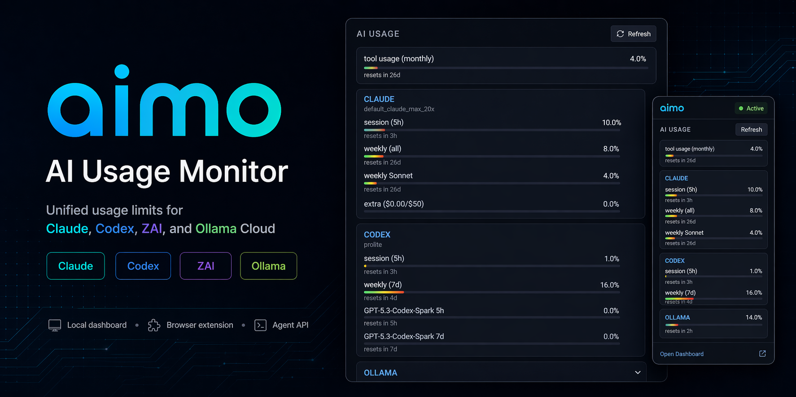

# aimo — AI Usage Monitor

A unified viewer for your **ZAI / Claude / Codex / Ollama Cloud** usage limits.
Bundles a Chromium extension and a local dashboard server.
**Zero-config for most providers** — reuses the browser session you're already logged into.

<p align="center">
  
</p>

[🇺🇸 English](#english) · [🇯🇵 日本語](#日本語)

---

## English

### What it does

One extension popup + one local dashboard shows the current usage window for all four services:

| Provider | Windows shown | How it fetches |
|---|---|---|
| Claude | 5h / 7d all / 7d Sonnet / 7d Opus / extra credits | `claude.ai/api/organizations/{uuid}/usage` via your claude.ai session cookie |
| Codex | 5h / 7d + Spark limits | `chatgpt.com/backend-api/wham/usage` — session → `/api/auth/session` → Bearer |
| ZAI | whatever time / token windows the plan exposes (labels inferred from reset time) | `api.z.ai/api/monitor/usage/quota/limit` — JWT auto-captured from z.ai localStorage (API key fallback) |
| Ollama | session / weekly | `ollama.com/settings` HTML parse via session cookie |

### Update policy (TOS-safe)

**aimo does not poll.** Requests fire only when:

- you open the extension popup,
- you click the manual **Refresh** button on the dashboard or popup,
- you open the dashboard page (one fetch per open),
- an agent hits `GET /api/usage` or `POST /api/refresh`.

Each request retrieves exactly the same data the provider's own usage page would show you. aimo is unaffiliated with Anthropic, OpenAI, Z.ai, or Ollama; verify each provider's terms of service before using it on shared or commercial accounts.

Plan differences are handled gracefully: if a provider's response doesn't include a particular window (e.g. no Opus quota on Claude Max, no Spark on Codex Plus, no weekly on legacy ZAI plans), it's simply omitted from the output.

### Features

- **Zero API keys** for Claude / Codex / Ollama — browser cookies are enough
- **Optional API key** for ZAI (needed only if the z.ai JWT capture fails)
- Per-provider **enable/disable toggles** in Options
- Local **dashboard** at `http://localhost:3030` with auto-refresh on open
- **JSON API** for agents: `GET /api/usage` and `POST /api/refresh`
- **Bitwarden integration** for the ZAI API key (`bw get password zai-api-key`)
- Works on **Chrome**, **Brave**, and any Chromium-based browser

### Requirements

- Node.js 20+
- A Chromium-based browser logged into each provider you want to track
- (Optional) Bitwarden CLI unlocked for server-side ZAI fallback

### Install

```bash
git clone <this-repo> aimo
cd aimo
npm install            # only dependency is dotenv
```

**Load the extension**:

1. Open `chrome://extensions` (or `brave://extensions`)
2. Enable **Developer mode**
3. Click **Load unpacked** and select the `extension/` folder

**Log into the providers you want to monitor** — nothing else to configure for Claude / Codex / Ollama. For ZAI, open `https://z.ai/` once while logged in (the extension captures the JWT from localStorage automatically).

### Run

**Dashboard server** (optional — extension works standalone):

```bash
node server.mjs
# → listening on http://localhost:3030
```

**CLI** (quick terminal view, no browser needed):

```bash
node cli.mjs              # pretty table
node cli.mjs --json       # machine-readable
```

### Agent / script API

```bash
curl -s http://localhost:3030/api/usage       # merged view, JSON
curl -sX POST http://localhost:3030/api/refresh   # same payload, semantic alias
curl -s http://localhost:3030/api/ping        # liveness probe
```

Server-side collectors (ZAI via Bitwarden / Codex via `~/.codex/auth.json`) run on every call. Ollama/Claude come from the last push the extension sent — open the dashboard or popup to refresh them.

### Options page

- **Providers** — check/uncheck to hide unused providers (stops fetching too)
- **Server** — status dot, "Recheck", copy the start command
- **For agents / scripts** — copy-paste curl snippets
- **Auto-auth status** — ZAI JWT capture indicator + "Open z.ai" button
- **Quick links** — direct links to each provider's usage page

### Privacy

- Auth tokens live in `chrome.storage.local` (per-browser, not synced)
- `.env` is git-ignored; the ZAI API key (if stored there) never leaves your machine
- The only outbound requests are to the provider APIs you're already using

### Architecture

```
aimo/
├── server.mjs              HTTP server (dashboard + /api/usage + /ingest)
├── cli.mjs                 terminal viewer
├── lib/env-resolver.mjs    Bitwarden CLI fallback
├── collectors/             server-side collectors (zai, codex, claude stub, ollama)
└── extension/              Manifest V3 extension
    ├── manifest.json
    ├── background.js       service worker — fetch + /ingest push
    ├── fetchers.js         per-provider fetch + parse
    ├── popup.html / .js    the extension popup UI
    ├── options.html / .js  setup page
    ├── content-bridge.js   injected on localhost:3030 (relays refresh)
    └── content-zai.js      injected on z.ai (captures JWT)
```

### License

MIT.

---

## 日本語

### 何をするツールか

1つの拡張ポップアップ + 1つのローカルダッシュボードで、4 サービスの現在の使用量ウィンドウをまとめて表示する。

| プロバイダ | 表示する項目 | 取得経路 |
|---|---|---|
| Claude | 5時間 / 週間 all / 週間 Sonnet / 週間 Opus / 追加クレジット | `claude.ai/api/organizations/{uuid}/usage`（claude.ai セッション Cookie）|
| Codex | 5時間 / 週間 + Spark 制限 | `chatgpt.com/backend-api/wham/usage` — セッション → `/api/auth/session` → Bearer |
| ZAI | プランが返す時間・トークン系ウィンドウ（ラベルは reset 時刻から自動推定）| `api.z.ai/api/monitor/usage/quota/limit` — z.ai localStorage から JWT 自動捕獲（API key フォールバックあり）|
| Ollama | セッション / 週間 | `ollama.com/settings` の HTML パース（セッション Cookie）|

### 更新ポリシー（TOS 配慮）

**aimo はバックグラウンド poll しない。** リクエストが飛ぶのは次のタイミングのみ：

- 拡張ポップアップを開いた時
- ダッシュボード/ポップアップの **Refresh** ボタンを押した時
- ダッシュボードページを開いた時（1 回 fetch）
- エージェントが `GET /api/usage` / `POST /api/refresh` を叩いた時

各リクエストで取得するのは、各プロバイダの自分の使用量ページに表示されるのと同じデータ。aimo は Anthropic / OpenAI / Z.ai / Ollama とは無関係。共有アカウントや商用アカウントで使う場合は各社の TOS を確認してください。

プラン差分はデータ駆動で処理される：レスポンスに含まれないウィンドウ（Claude Max で Opus 枠がない、Codex Plus で Spark がない、レガシー ZAI プランで週制限がない等）は単純に表示から省かれる。

### 特徴

- **API キー不要**で Claude / Codex / Ollama が動く — ブラウザの Cookie だけで OK
- **ZAI のみ**任意で API key（z.ai の JWT 捕獲に失敗した場合のフォールバック）
- Options ページで**プロバイダごとの有効/無効切替**
- ローカル **ダッシュボード** `http://localhost:3030`（開いた時に自動 refresh）
- エージェント向け **JSON API**：`GET /api/usage` と `POST /api/refresh`
- **Bitwarden 連携**で ZAI API key を自動解決（`bw get password zai-api-key`）
- **Chrome** / **Brave** など Chromium 系ブラウザで動作

### 必要なもの

- Node.js 20 以上
- 監視したい各プロバイダにログイン済みの Chromium 系ブラウザ
- （任意）Bitwarden CLI（サーバー側 ZAI フォールバック用）

### インストール

```bash
git clone <このリポジトリ> aimo
cd aimo
npm install            # 依存は dotenv だけ
```

**拡張の読み込み**：

1. `chrome://extensions`（または `brave://extensions`）を開く
2. **デベロッパーモード** を ON
3. **パッケージ化されていない拡張機能を読み込む** → `extension/` フォルダを選択

**監視したいプロバイダにログイン**するだけで Claude / Codex / Ollama は動く。ZAI は `https://z.ai/` を一度開けば（ログイン済み状態で）拡張が localStorage から JWT を自動キャプチャする。

### 起動

**ダッシュボードサーバー**（任意、拡張だけでも動く）：

```bash
node server.mjs
# → http://localhost:3030 で待機
```

**CLI**（ブラウザ不要でサクッとターミナルで見る）：

```bash
node cli.mjs              # 整形表示
node cli.mjs --json       # JSON 出力
```

### エージェント/スクリプト向け API

```bash
curl -s http://localhost:3030/api/usage          # マージ済みビュー、JSON
curl -sX POST http://localhost:3030/api/refresh  # 同じ内容、セマンティックなエイリアス
curl -s http://localhost:3030/api/ping           # 生存確認
```

サーバー側の収集（ZAI は Bitwarden / Codex は `~/.codex/auth.json`）は毎コール走る。Ollama/Claude は拡張からの直近 push を返す — ダッシュボードかポップアップを開けば更新される。

### Options ページ

- **Providers** — 使わないプロバイダをチェック外しで非表示（fetch も止まる）
- **Server** — 生存インジケータ、Recheck、起動コマンドをコピー
- **For agents / scripts** — curl コマンドをコピペ用に表示
- **Auto-auth status** — ZAI JWT キャプチャ状態 + 「Open z.ai」ボタン
- **Quick links** — 各プロバイダの usage ページへ直接遷移

### プライバシー

- 認証トークンは `chrome.storage.local` に保存（ブラウザローカル、同期なし）
- `.env` は git-ignore 済み。ZAI API key をそこに置いてもマシン外に出ない
- 外向き通信は既にあなたが使っているプロバイダの API のみ

### 構成

```
aimo/
├── server.mjs              HTTP サーバー（ダッシュボード + /api/usage + /ingest）
├── cli.mjs                 ターミナルビューア
├── lib/env-resolver.mjs    Bitwarden CLI フォールバック
├── collectors/             サーバー側 collectors（zai, codex, claude スタブ, ollama）
└── extension/              Manifest V3 拡張
    ├── manifest.json
    ├── background.js       service worker — fetch + /ingest push
    ├── fetchers.js         各プロバイダの fetch + パース
    ├── popup.html / .js    拡張ポップアップ UI
    ├── options.html / .js  設定ページ
    ├── content-bridge.js   localhost:3030 に注入（refresh リレー）
    └── content-zai.js      z.ai に注入（JWT キャプチャ）
```

### ライセンス

MIT
